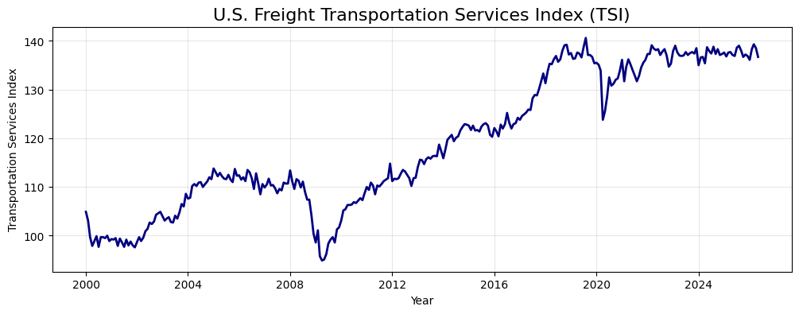
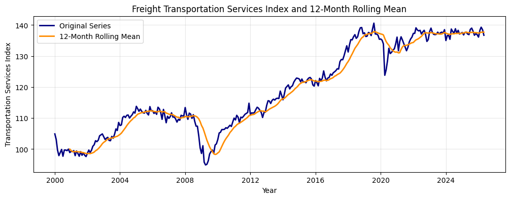
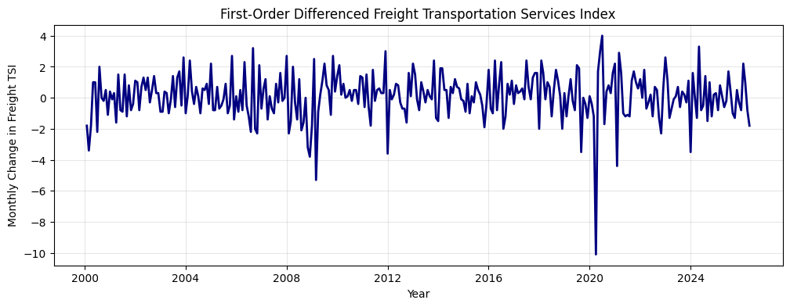

# Forecasting U.S. Freight Activity

## Project Objective

This project uses the Bureau of Transportation Statistics Freight Transportation Services Index to forecast short-term U.S. freight activity.

The goal is to evaluate how accurately a SARIMA time series model can predict future freight activity using historical monthly data.

## Data Source and Preparation

The analysis uses the Freight Transportation Services Index from the U.S. Bureau of Transportation Statistics.

The dataset contains **317 monthly observations** covering **January 2000 through May 2026**. The analysis uses two fields:

- `OBS_DATE`: Monthly observation date
- `TSI_Freight`: Freight Transportation Services Index

The date field was converted to a datetime format and used as the time-series index. The dataset was also checked for missing values before beginning the analysis.

## Historical Freight Activity

The dataset contains monthly Freight Transportation Services Index observations from January 2000 through May 2026. The historical series shows long-term growth in U.S. freight activity, along with periods of significant disruption and recovery.



## Stationarity Analysis

Before building the forecasting model, the series was tested to determine whether its average level remained stable over time.



The rolling mean changes throughout the observation period, showing that the original series contains a long-term trend.

The Augmented Dickey-Fuller test produced:

| Metric | Result |
|---|---:|
| ADF Statistic | -0.9585 |
| p-value | 0.7681 |

Because the p-value is greater than 0.05, the original Freight TSI series was considered non-stationary.
## First-Order Differencing

Because the original series was non-stationary, first-order differencing was applied to remove the long-term trend.



After differencing, the series fluctuates around zero with no clear long-term trend.

A second Augmented Dickey-Fuller test produced:

| Metric | Result |
|---|---:|
| ADF Statistic | -10.8589 |
| p-value | < 0.001 |

The results confirm that the differenced series is stationary and ready for time series modeling.

## Train-Test Split

The data was divided into training and testing periods to evaluate the model on unseen observations.

| Dataset | Period | Observations |
|---|---|---:|
| Training | January 2000 – December 2025 | 312 |
| Testing | January 2026 – May 2026 | 5 |

The model was trained using the historical data and then used to forecast the five months in the testing period. The predictions were compared with the actual Freight TSI values to measure forecast accuracy.

## SARIMA Forecasting Model

A SARIMA model was used because the Freight TSI is monthly time series data and may contain both short-term and seasonal patterns.

The model configuration was:

- Non-seasonal order: `(1, 1, 1)`
- Seasonal order: `(1, 1, 1, 12)`
- Seasonal period: `12 months`

```python
sarima_model = SARIMAX(
    train,
    order=(1, 1, 1),
    seasonal_order=(1, 1, 1, 12)
)

sarima_results = sarima_model.fit()
